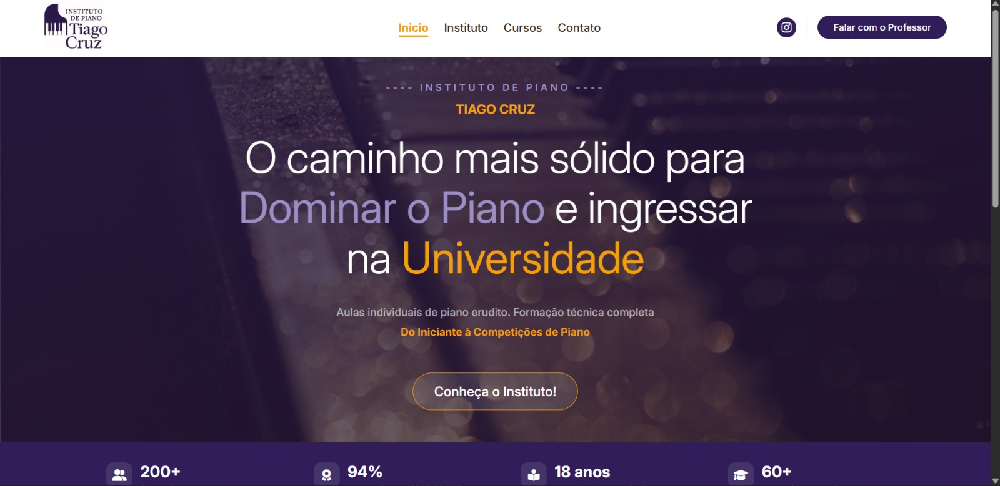
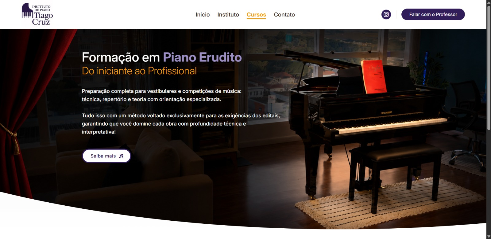
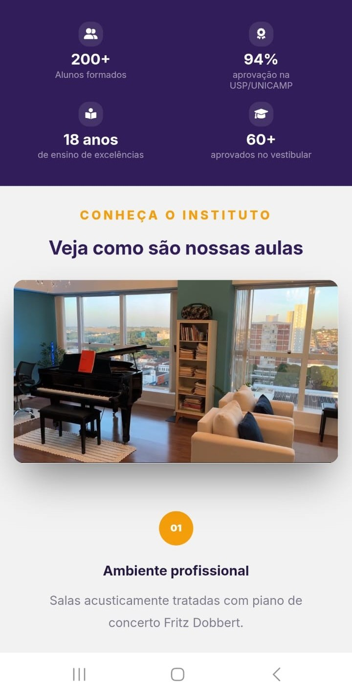
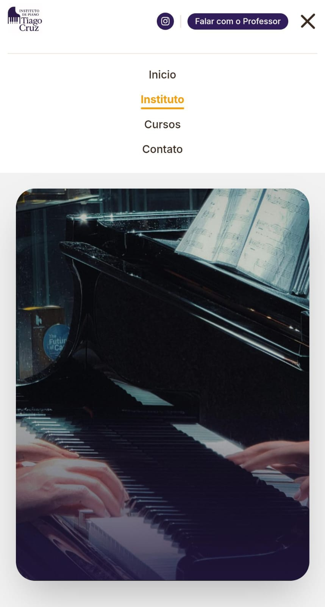

# 🎹 Piano Institute – Institutional Website

## 📖 About the Project

This project consists of the development of an **institutional website** for a piano institute.

Its primary goal is to provide a modern platform that showcases the institute, presents its services, and makes it easier for prospective students to get in touch.

Although the current version is a static website, it was built using the **Django** framework to establish a scalable foundation for future backend features, such as user authentication, content management, and database integration.

The project was developed collaboratively as part of the **Web Development** course during the **3rd semester of the Computer Science program** at **Centro Universitário Barão de Mauá**.

---

## ✨ Features

* Institutional homepage;
* Institute presentation;
* Information about piano lessons;
* Contact section;
* Responsive interface;
* Mobile navigation with a hamburger menu;
* Django project structure prepared for future backend development.

---

## 👨‍💻 My Contribution

I served as the technical lead of the project and was responsible for:

* Setting up the Django project structure;
* Designing the project's architecture and directory organization;
* Configuring the development environment and application settings;
* Managing Git branches and coordinating the team's development workflow;
* Reviewing code integrations and maintaining coding standards across the project.

Once the project structure was established, each team member became responsible for developing the frontend of their assigned pages.

During the final stage of development, I also contributed by:

* Deploying the application using Vercel;
* Refining the interface for different screen sizes;
* Implementing the responsive hamburger navigation menu.

---

## 🚀 Technologies Used

### Languages & Framework

* Python
* Django
* HTML5
* CSS3
* JavaScript

### Tools

* Git
* GitHub
* Vercel

---

## 🌐 Live Demo

The application is available at:

> https://site-piano-tiago-cruz.vercel.app

---

## 📷 Screenshots

### Desktop Version

  
  

### Mobile Version

  
  

---

## 📌 Future Improvements

* Administrative dashboard for content management;
* User authentication;
* Online lesson scheduling;
* Database integration;
* Contact messaging system;
* Student portal;
* Client-managed content uploads.

---

## 👥 Team

This project was developed collaboratively during the **Web Development** course at **Centro Universitário Barão de Mauá**, following a Git-based workflow for version control and team collaboration.
